# **Goodwin Lab User Guide**


# Table of contents:


<!-- TOC START min:1 max:4 link:true asterisk:false update:true -->
- [**Goodwin Lab User Guide**](#goodwin-lab-user-guide)
- [Table of contents:](#table-of-contents)
- [Usage:](#usage)
    - [Caution:](#caution)
- [Recording Station:](#recording-station)
    - [Preparing the setup:](#preparing-the-setup)
        - [Double Check Camera Settings:](#double-check-camera-settings)
            - [Connecting to the Camera:](#connecting-to-the-camera)
            - [Load Camera Settings:](#load-camera-settings)
        - [Turning on the Backlight:](#turning-on-the-backlight)
            - [Timer Switch:](#timer-switch)
            - [Station-B's Backlight Intensity:](#station-bs-backlight-intensity)
            - [Station-B's Backlight and Optogenetics GUI:](#station-bs-backlight-and-optogenetics-gui)
        - [Starting a Live Preview:](#starting-a-live-preview)
        - [Framing and Backlight Intensity:](#framing-and-backlight-intensity)
            - [Framing:](#framing)
            - [Backlight Intensity:](#backlight-intensity)
    - [Starting a video recording:](#starting-a-video-recording)
        - [Launch Strand-Camera:](#launch-strand-camera)
        - [Record a Video:](#record-a-video)
        - [Done Recording:](#done-recording)
    - [Video Transfer:](#video-transfer)
        - [Settings file description:](#settings-file-description)
        - [Starting the Transfer:](#starting-the-transfer)
- [Tracking:](#tracking)
- [Tracking Results:](#tracking-results)
    - [Where are my results?](#where-are-my-results)
        - [FileZilla:](#filezilla)
        - [Map a network drive:](#map-a-network-drive)
    - [Navigating your results:](#navigating-your-results)
        - [Results/example_video_1_ALLDATA_R.csv.gz:](#resultsexample_video_1_alldata_rcsvgz)
        - [Results/example_video_1_Diagnostic_Plots_R.pdf:](#resultsexample_video_1_diagnostic_plots_rpdf)
        - [Results/example_video_1_Ethogram.pdf:](#resultsexample_video_1_ethogrampdf)
        - [Results/example_video_1_Indices.csv:](#resultsexample_video_1_indicescsv)
        - [Other files:](#other-files)
        - [Arena and Fly Numbering:](#arena-and-fly-numbering)
<!-- TOC END -->


# Usage:
<a name="usage"></a>

This _"user guide"_ is intended to aid the members of the Gooodwin Lab to use this _"pipeline"_ as it is currently deployed. It is not intended as general user guide for any other end user who wishes to use any of this code. But do feel free to use any of this code if you'd like, or if it may be useful to you. We'd only ask that you cite ["Nojima, Rings, et al., 2021"](https://www.sciencedirect.com/science/article/pii/S0960982220318996?via%3Dihub).

The _"pipeline"_ can accommodate our usual 20 arena chambers. You can also adjust the camera to zoom into 5 of the 20 arenas, or a single arena.

Here we show an example still from one of our 20 arena chambers.
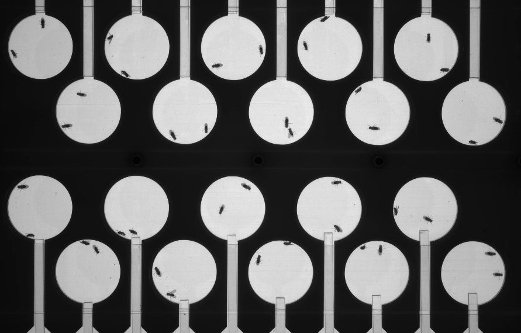

## Caution:

When loading your flies into the chambers please follow these instructions:
- Put the same number of flies in each chamber. For example, do not mix a 2-fly and a 3-fly experiment in the same video.
- Ensure at least 5 arenas contain flies. The Caltech Flytracker can run into issues if too many of the arenas are empty in a multi-arena video.
- If you are not using all 20 arenas, place your flies in the top arenas. FlyTracker will not work if the top 10 arenas (as seen in the video) of the 20 arenas are empty.


**_Navigation:_**
- [Back to top](#top)
- [Back to Usage](#usage)
- [Next: Recording station](#rec)

# Recording Station:
<a name="rec"></a>

Please ensure that you have reserved your time slot for either Station's A, B, or C on the Goodwin Lab behaviour room Google calendar. You should reserve the station even if you are not using the computer - if you are occupying the space, then no one else is able to use it.

If you are planning on running an optogenetics experiment, please book Station B. For thermogenetics experiments, book Station C.


## Preparing the setup:

First, login with the `Recoding` user name. Once you login, you will see the following:


### Double Check Camera Settings:

It is important to double check the camera settings before you start recording. Different assay require different configurations. To check and change the camera settings, open Basler's "Pylon Viewer" software.

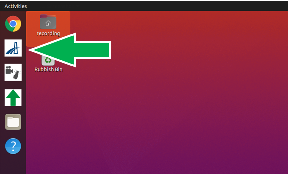


#### Connecting to the Camera:

When Pylon first opens, you will not see anything from the camera, but you should see the camera listed in the upper left box labelled `Devices` under `USB`. Station-A will have the camera `Basler acA1920-155um` camera, and Station-B and Station-C will both have a `Basler acA2440-75um` camera.

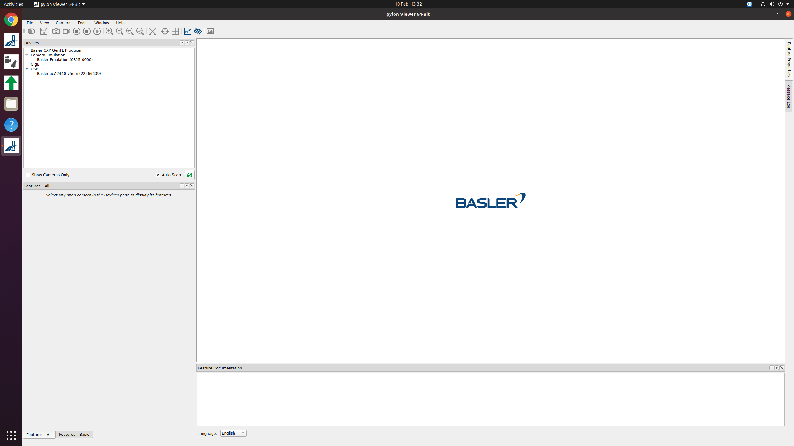


First you will need to "start" the software connection to the Camera. Once you select the camera, the "toggle switch" just below the `File` menu item will change from grey to red.

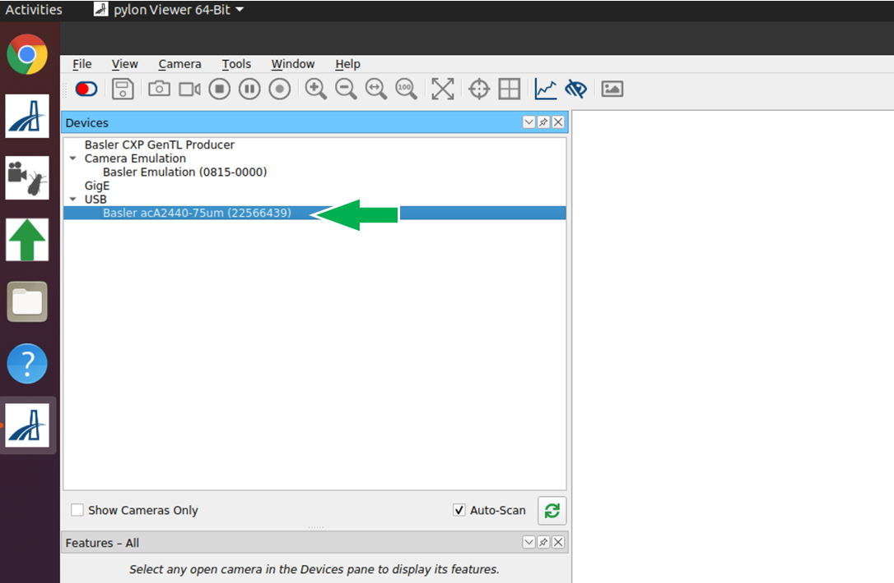

To start the connection to the camera, click on the "toggle switch". It will change colour to green, and a tab with the same name of the camera will open in the right pane. It still won't display what the camera is seeing, as we haven't started a stream yet.


After selecting the camera, the lower left pane will also populate with information and settings for the camera.


#### Where's the Camera ?!?!

If you open Basler's Pylon Viewer and you can't see the 'Devices' pane, or the layout looks weird for any reason, you'll want to reset it. These panes are customizable and can be reshaped and closed. This will happen from time to time accidentally and you just need to reset the window pane layout to get everything back the way it was.

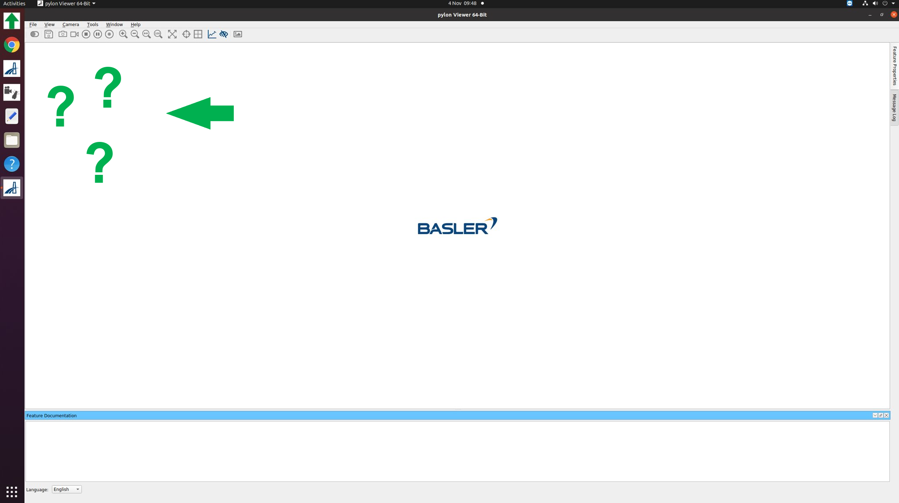

To reset the layout, click on the 'Window' item in the menu bar and then click 'Reset Window Layout'.

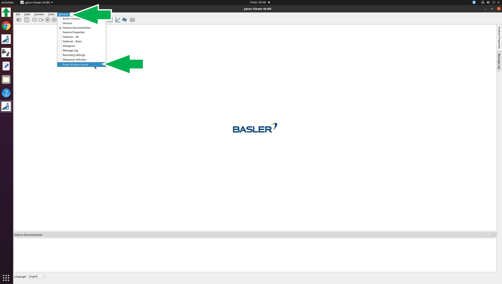

Once clicked the window panes will reset to default and you'll be good to go. Now just select your camera and toggle it on, as before.

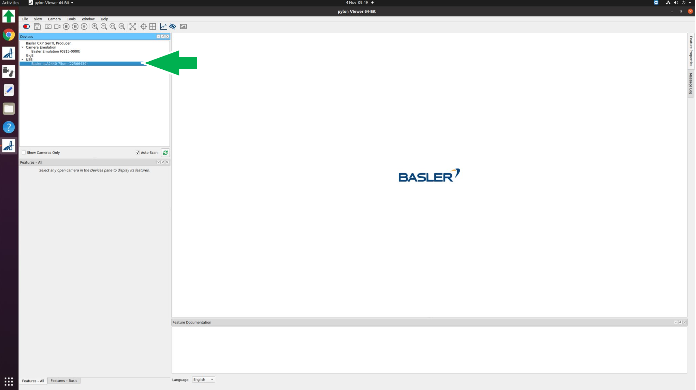


#### Load Camera Settings:

_"User Set"s_ allow for pre-defined parameters for the camera such as number of x and y pixels, frames per second (fps), etc. Before we start a live stream from the camera we want to load a _"User Set"_. For standard courtship assay experiments load `User Set 1`. For FlyBowl arena experiments load `User Set 2`. And for Optomotor arena assays load ` User Set 3`.

To load a _"User Set"_, click on the  `User Set Control` option in the lower left panel. To choose an option, click on the dropdown menu next to `User Set Selector`.

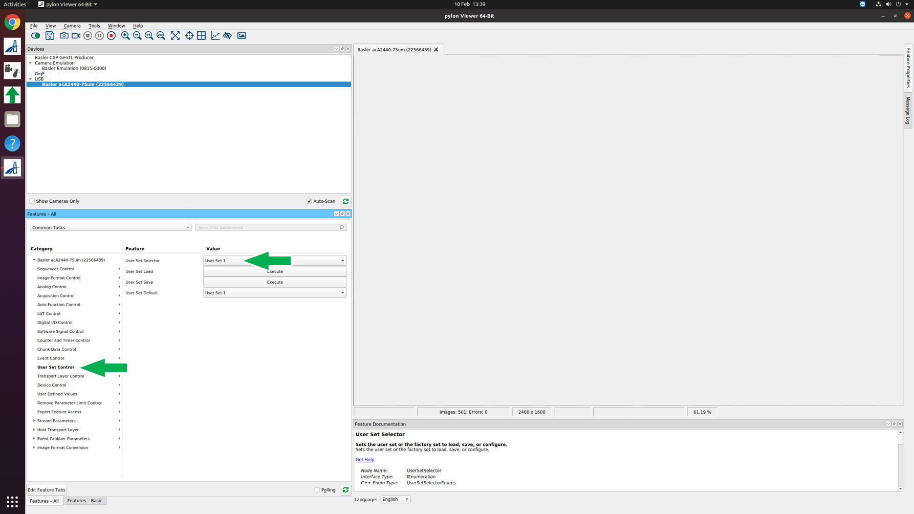

Select the appropriate _"User Set"_ from the dropdown menu. In this case we show selecting `User Set 1` for standard courtship assays.

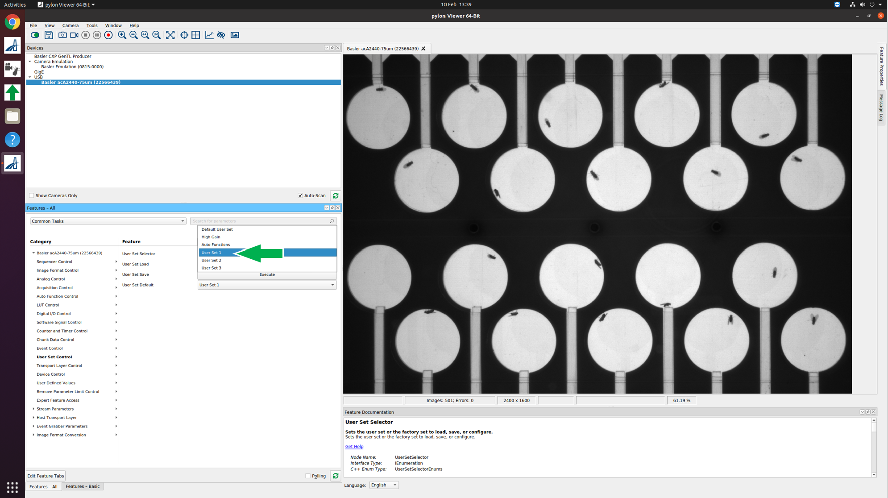

To load these settings click on the `Execute` button next to `User Set Load`.

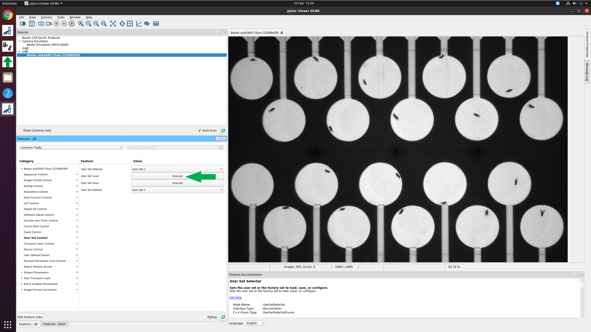

At this point your parameters should be loaded. It is good to double check that the settings are correct. We will be able to see if the parameters are correct once we start a live stream from the camera.


**_Navigation:_**
- [Back to top](#top)
- [Back to Recording Station](#rec)
- [Previous: Usage](#usage)
- [Next: Tracking](#tracking)

### Turning on the Backlight:

Before we start a live preview/stream from the camera, we will need to turn on the backlight. We use infrared (IR) backlights and a IR longpass filter on our cameras. This filter blocks out visible light and only allows IR light through. Station-A and Station-C have the same IR backlight setup, but Station-B is a bit different as the optogenetics light and IR backlight are built into the same unit.

#### Timer Switch:

Since we can not see the light emitted by the IR backlight, it is very easy forget to turn the IR backlight off. To avoid the issue of leaving the backlight on for prolonged, we use an outlet timer switch.

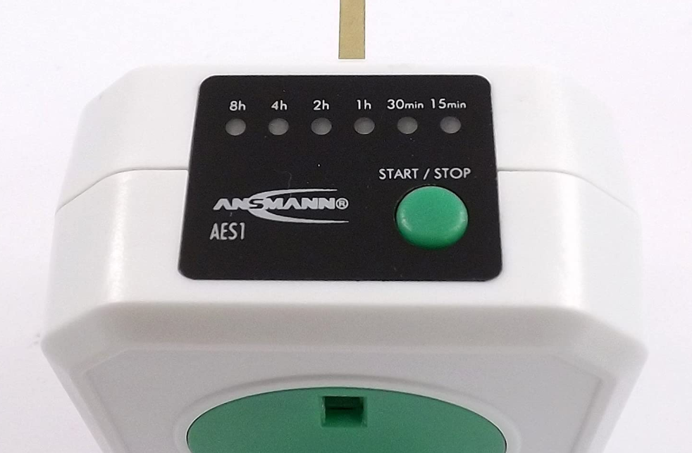

To turn the backlight on, hold down the green `START/STOP` button for a second (or two), until you hear a click and the green light will eluminate under the `15min` label. To increase the time click the `START/STOP` button. Each click will advance the time to the next doubling. It should be noted that these times are approximate. If you are going to record an hour long video, set the timer to `2h` to ensure it doesn't turn off before your video is done.

#### Station-B's Backlight Intensity:

The light intensity for Station-B's backlight and the optogenetic light are controlled via this controller, which has to be plugged into the outlet timer switch.

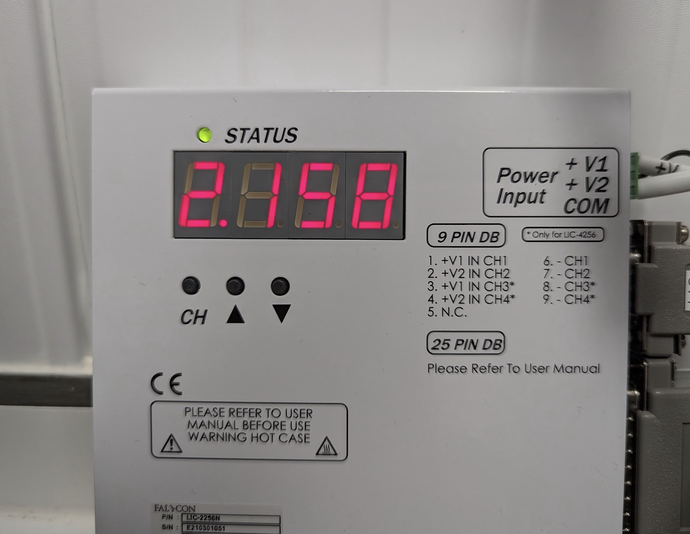

To set its intensity, first select the channel by pressing the 'ch' button. The channel (1 or 2) is the first number displayed on the controller in front of the dot. Channel 1 corresponds to the optogenetic light and channel 2 corresponds to the IR backlight.

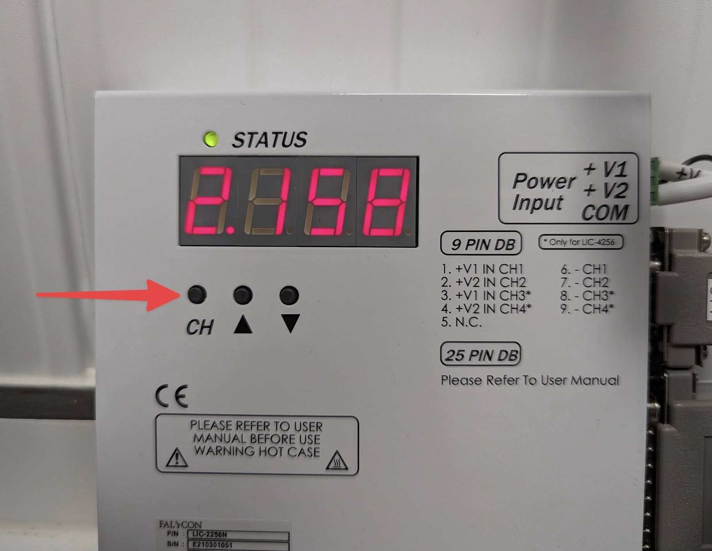

Backlight intensity can be set using the up and down buttons. The intensity ranges from 0 to 255. It is displayed after the dot. Please leave this set to `158` and only adjust if you know what you are doing. If you are recording any of the standard video setups and this value isn't set to `158`, change it back to this value before proceding.

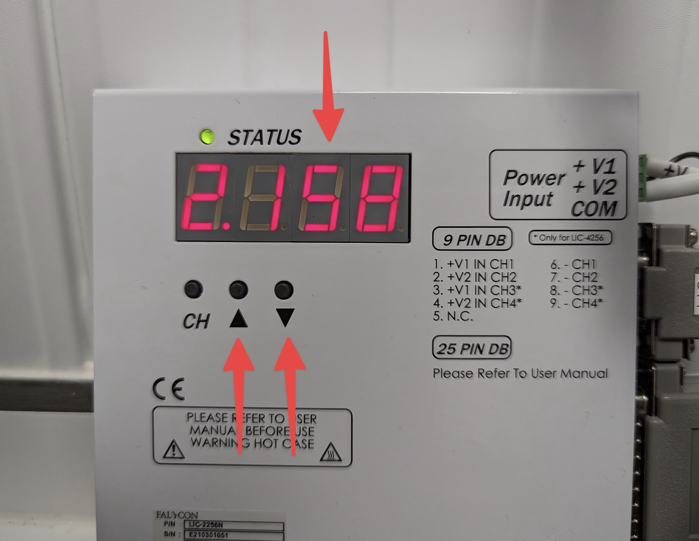


#### Station-B's Backlight and Optogenetics GUI:

For Station-B, the _"on/off"_ state and timings of both the backlight and the optogenetic light are controlled using MATLAB. Open the MATLAB script called `optogenetic_gui.m` and run it by pressing the 'run' button in the 'Editor' tab.

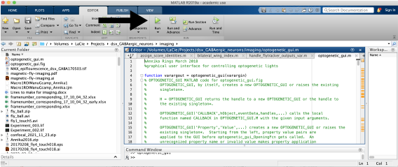

This will bring up the GUI.

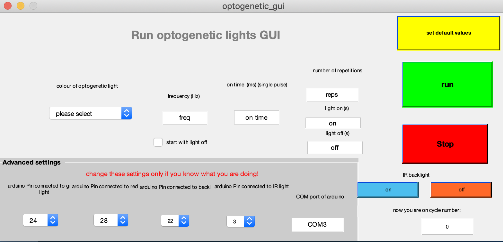

Set all the numbers to the desired values. To start, you can press the 'set default values' button, which will set everything to default values. Afterwards, adjust the numbers to suit your experiment. Don't change the Advanced settings unless you have a good reason to do so.

If you are using the backlight, select 'optogenetic backlight' from the 'colour of optogenetic light' dropdown menu.

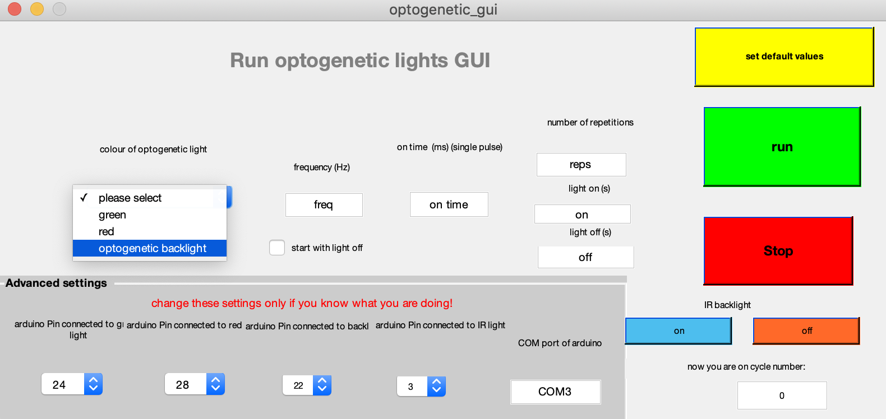


To switch on the backlight, press the 'on' button under IR backlight. To switch it off, press the 'off' button. If you are running both the backlight and the optogenetic light, switch on the IR light first before pressing the 'run' button.


If you are performing an optogenetic experiment, place the IR indicator light on the RIGHT of your chamber as shown in the picture. The IR filter in front of the camera will not let the optogenetic light pass through, therefore you will not be able to see when the lights come on in the video. The indicator light comes on at the same time as the optogenetic light and is used to determine when the optogenetic light was on. If you place it on the right side of the chamber, between the top 10 and the bottom 10 chambers, it will automatically be detected by the tracking. Please be careful not to obstruct any of the chambers.


To start the optogenetic lights, press the green 'run' button. They will automatically switch off after the end of your protocol. If you need to stop them before the end of the protocol, you can press the red 'stop' button.

### Starting a Live Preview:

**Warning** - there is a bug in Basler's Pylon software and you can not start a video stream immediately. Select the `Stream Parameters` Category in the lower left panel. You then need to increase the `Maximum Tr...` (Maximum Transfer Size) from a value of `262144` to anything higher by clicking on the up arrowhead. Here I show setting it to `262148`, but realistically it just needs to be anything other than the default when opening Pylon Viewer.

<!-- replace the stream params image so be able to see the full Maximum Transfer Size -->
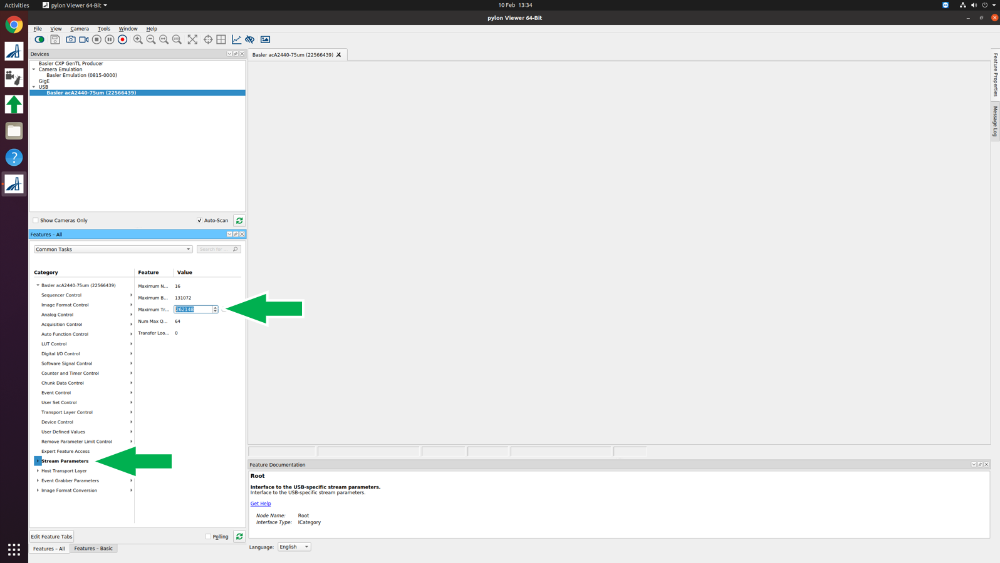

Once you have changed the `Maximum Transfer Size` you can start a live video stream by selecting the video camera icon at the top.

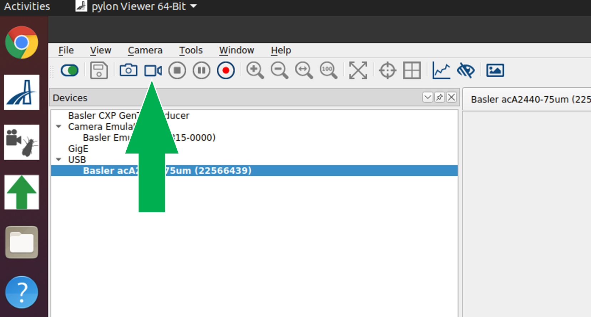

After selecting the video camera icon, the live stream (preview) will start in the right pane. The camera setting information such as frames per second, x any y pixels, etc can be seen just below the stream. All `User Sets`s should be  `25 fps`. For `User Set 1` Station-A camera should have a `1800 x 1200` pixels, and Station-B and Station-C should have `2400 x 1600` pixels. For `User Set 2` and `User Set 3` Station-B and Station-C should have `2400 x 2040` pixels. Station-A is currently not set up for `User Set 2` and `User Set 3` but will be soon, once the new camera comes in.

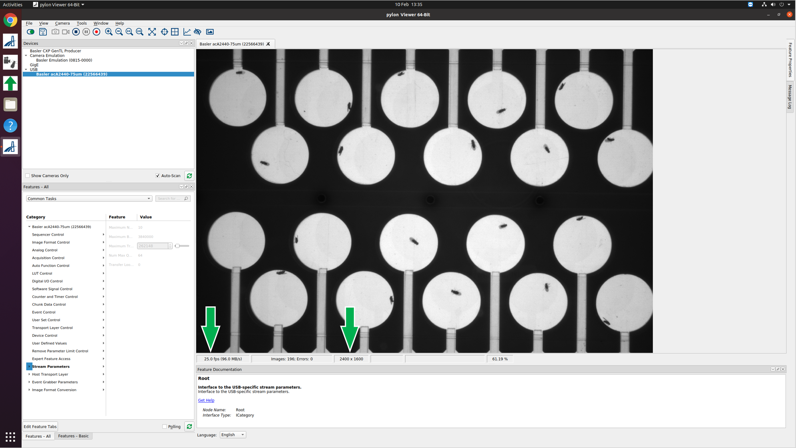

**_Navigation:_**
- [Back to top](#top)
- [Back to Recording Station](#rec)
- [Previous: Usage](#usage)
- [Next: Tracking](#tracking)


### Framing and Backlight Intensity:

#### Framing:

Now you can start a stream to check for framing of the video. The edges of all the arenas you want to be tracked need to be visible. Ensure that the framing does not cut off any of the arenas. Below we show an image where the arenas 10 and 20 are cropped on their right sides. Avoid this sort of issue.

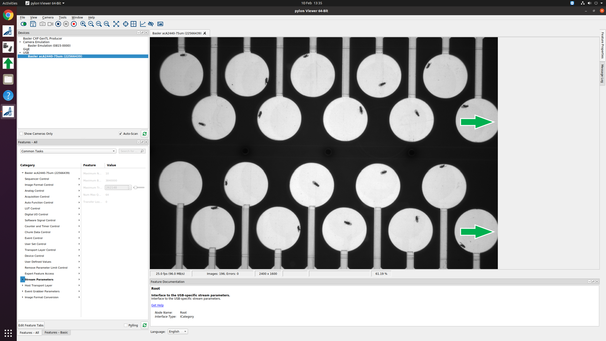

#### Backlight Intensity:

It is important that the light intensity is set appropriately in order to get accurate tracking results. The intensity knob on the Falcon light source should be turned to its maximum. Then the aperture of the camera should be adjusted such that the brightest part of the video registers less than 255 (and typically more than 240) and the darkest part of the video registers more than 0 (and typically less than 15).

Here we show an image while hovering the cursor the left side of the arena 8 (2nd row from the top, 3rd arena from the left). The intensity value can be seen below the video frame labelled `Mono`.

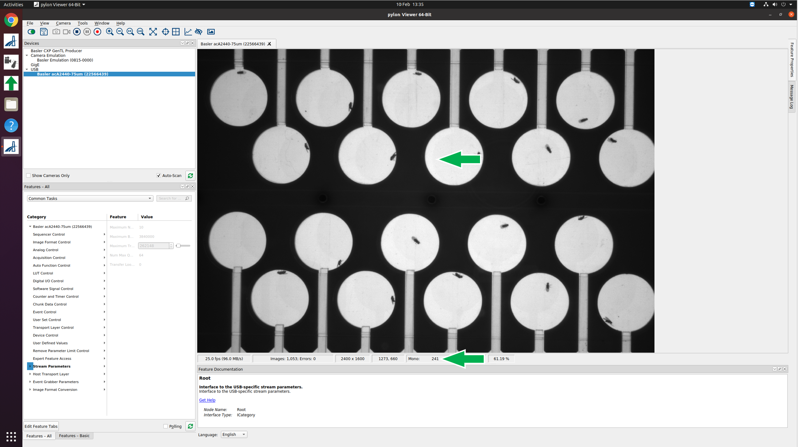

For the lower bound of the light intensity, hovering the cursor over one of the bolt heads is usually the darkest.

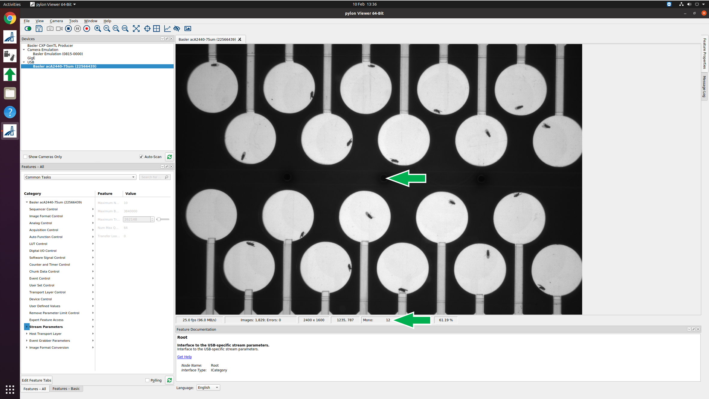


Adjusting the aperture in this way prevents clipping (either the brightest spot stuck on 255 or the darkest spot stuck on 0) and ensures that we will be recording all the data that we can, without washing anything out. We adjust this by the aperture of the camera, and not by the intensity knob of the backlight to ensure maximum [depth of field](https://en.wikipedia.org/wiki/Depth_of_field). If the depth of field is too shallow and someone has inappropriately adjusted the camera such that its sensor is not parallel to the arenas, then not all flies will be in focus and tracking errors may occur.


**_Navigation:_**
- [Back to top](#top)
- [Back to Recording Station](#rec)
- [Previous: Usage](#usage)
- [Next: Tracking](#tracking)


## Starting a video recording:

After you have finished setting up the camera and your framing etc, you must close "Pylon Viewer" before you launch "Strand-Camera". Only one program is "allowed" to be connected to the camera at one time.

We will now be using "Strand-Camera" software to record our behaviour videos. More information about Strand-Camera software is available [here](https://strawlab.org/strand-cam/) from its developers.


### Launch Strand-Camera:

To start a recording session click the `Record` icon in the side bar (the one with a video camera and a fly).

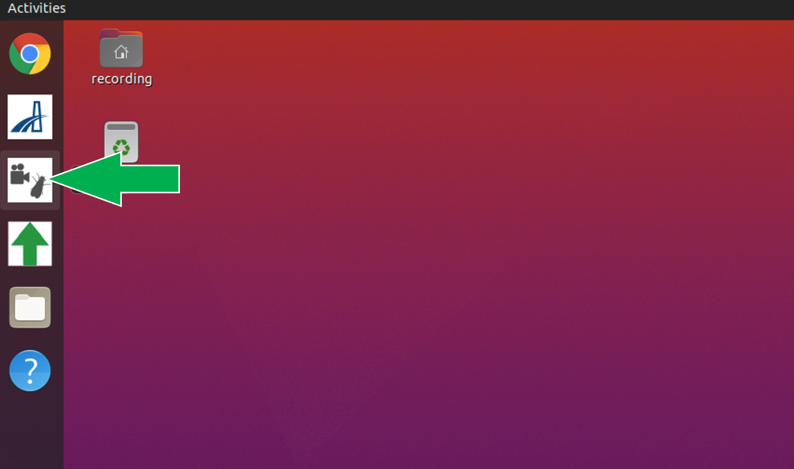


After launching, you will be prompted to enter your user name. This is the same as it appears in the `videos` directory. Type in your username (mind your capitalizations) and press `enter`.

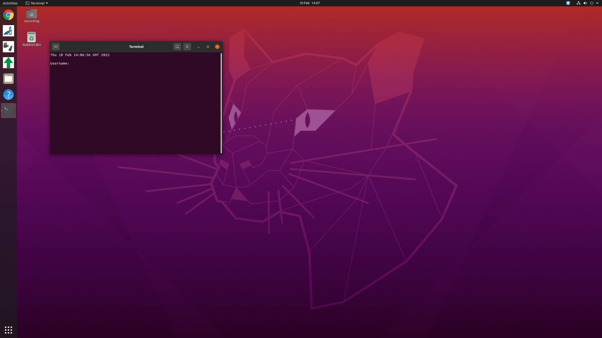

Once you have entered you username, the script will automatically generate a new folder named with todays date (`<YYY-MM-DD>`) in your videos folder. For example, if I (Aaron) ran this script on January 25th 2022, it would create the following folder: `/mnt/local_data/videos/Aaron/2022-01-25/`. Once this folder is created, Strand-Camera will launch.

"Strand Camera" runs in a web browser and some of the configuration settings can be changed within this interface. At the top of the screen is a "Live view" of the camera.

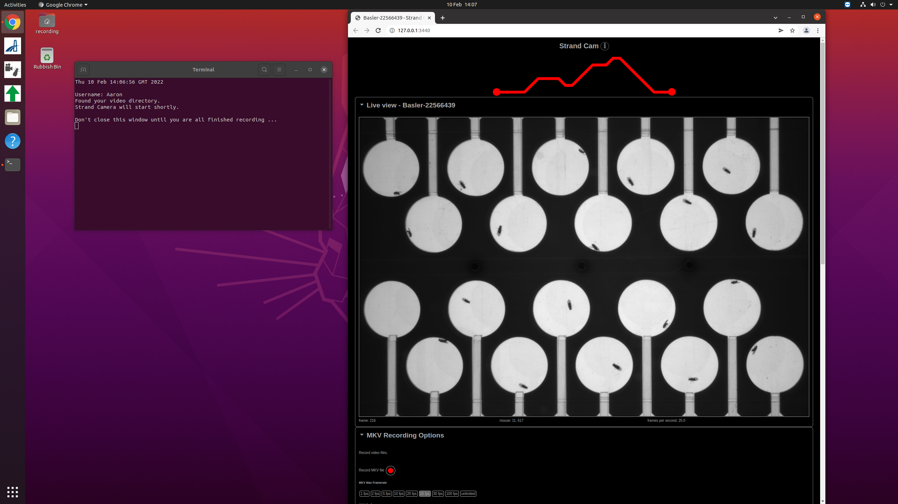

### Record a Video:

You will then be able to record videos from this web interface. For now, we are going to be recording videos in `mkv` containers. These options are in the second section, `MKV Recording Options`, below the `Live view` section.

Before we start recording, we need to change a few of the default options in the `MKV Recording Options` section. Stand-Camera defaults to using the `VP8` codec and a bitrate of `1000`.

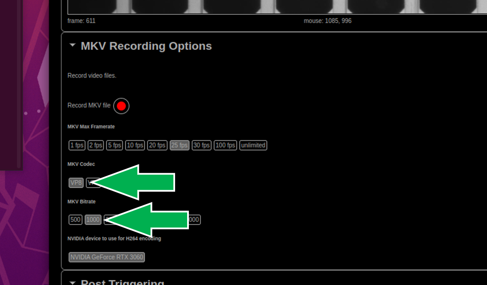

But we want to change this to the `H264` codec and a bitrate of `10000`. If the `H264` option isn't there - DO NOT RECORD - as the recording will not take advantage of the GPU and will likely drop frames.

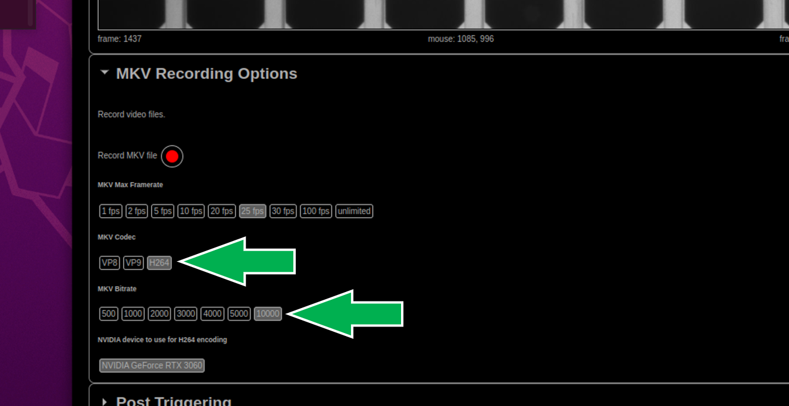

To start the recording, click the red, circular, button next to `Record MKV file`. Don't worry about the `%Y%m%d_%H%M%S.%f` bit next to the `Saving movie " ... "`, that's normal. The videos will be named appropriately; something like `movie20220215_105331.409348403.mkv`.

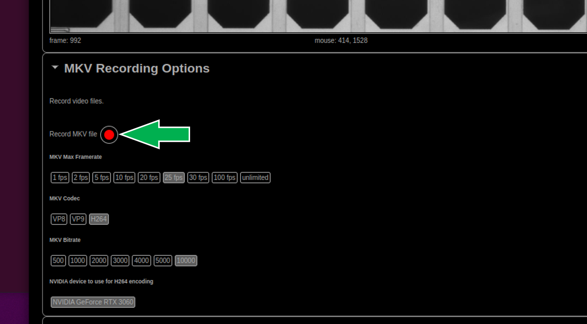


To stop the recording click the red, square, button. Strand-Camera does not have a recording length option, so you will have to manually stop the recording of each video.


You can record multiple videos back-to-back with from this interface and all the videos will be named for the start time of the recording.

Once you are finished recording, you may change the names of these videos if you'd like, but do make sure that the names of the videos match the names in you settings file (see below). And please **do not** use commas or spaces in your file names.

<!--
For now, we will be recording `.mkv` video files. We may in the future sort how to deal with videos recorded directly to `.ufmf`, but are not for now - currently Caltech FlyTracker does not support reading of Straw Lab `.ufmf` videos.
-->

### Done Recording:

Once you have finished recording, you can simply close the web browser and the terminal window to stop the software running.


**_Navigation:_**
- [Back to top](#top)
- [Back to Recording Station](#rec)
- [Previous: Usage](#usage)
- [Next: Tracking](#tracking)


## Video Transfer:

In order to track your videos, you need to generate a _"settings"_ file with a list of [parameters](#settings-file-description) our pipeline and the tracking software require. This is a plain text file that can be created and edited in the application "Text Editor". Open "Text Editor" and add the information for your videos.

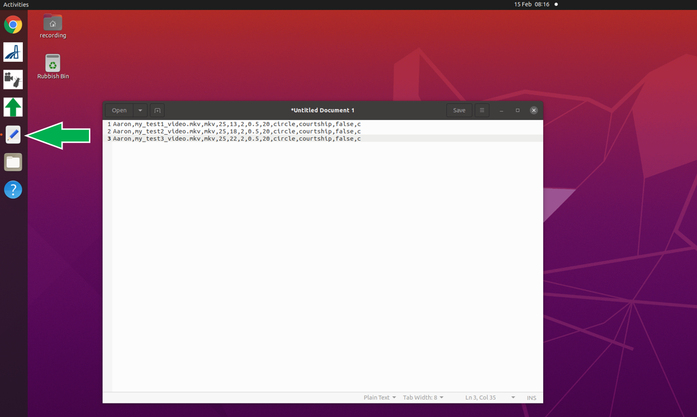

Once you have entered your information, you'll need to save this text file in the same folder as your videos. Click the save button, select the `data` folder in the side bar, and navigate to your video folder where you just recorded your videos. You can name this file how ever you'd like.

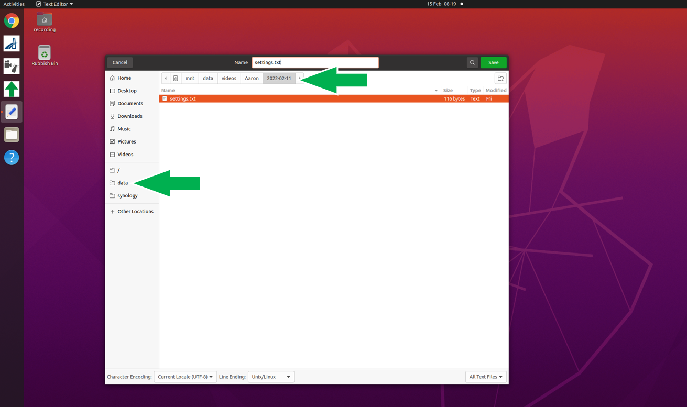

Alternatively, you can copy an existing settings file in from a previous recording session into your current video folder and edit it.


### Settings file description:

The settings file is a comma separated values plain text file (*.txt) where the user can specify multiple parameters to ensure their video gets tracked accordingly. These parameters need to be in this exact order and all should be present.
- `user`: your first name, as it appears in the video recording directory.
- `video_name_with_extension`: The name of your video to be tracked.
- `video_type`: The container used for the video (will typically be "mp4", but can also be "mkv", "ufmf", "fmf", "avi", etc).
- `fps`: frames per second of the video.
- `tracking_start_time_in_seconds`: The time (in seconds) that you want tracking to start for your video.
- `flies_per_arena`: The number of flies per arena.
- `sex_ratio`: The proportion of male flies per arena (one male and one female would be 0.5, two males and one female would be 0.67, all females would be 0, etc).
- `number_of_arenas`: How many whole arenas are visible in the video (default for courtship is 20, but may also be 1 or 5). **NB:** not the number of arenas with flies in them.
- `arena_shape`: Either "circle" or "rectangle".
- `assay_type`: This will be "courtship" for the most part, but potentially "optomotor" or "flybowl", and even "oviposition" or "phototaxis" as we add support for other behaviours.
- `optogenetics_light`: "true" or "false". Whether the optogenetics indication light was used, and tracking should attempt detection of it.
- `recording_station`: Which station was used. Either A, B, or C. This is only for documentation purposes and to keep track of any issues.
- `tracking_stop_time_in_seconds`: The time (in seconds) that you want tracking to STOP for your video, counting from the `tracking_start_time_in_seconds`, and not from the start of the video.

An example line for a settings file:

`Aaron,my_test_video.mkv,mkv,25,13,2,0.5,20,circle,courtship,false,c`

The settings file should only have a line for each video. Do not have an empty line at the start, and do not have an empty line at the end.

### Starting the Transfer:

Once you have made/edited your settings file, you can start transferring your videos by clicking on the "Transfer" (green up arrow). This will start a script that will prompt you for information. It will first ask for your name, then recording folder, and finally the name of your settings file. If these values have been entered properly and there isn't any issues with your settings file, then the transfer will start automatically. This window will close once the transfer is complete. **Do not** close this window before it is done transferring. If there is any errors (typos etc), the script will prompt you with what it thinks is wrong. Double check what it suggests, close the window, and start again.

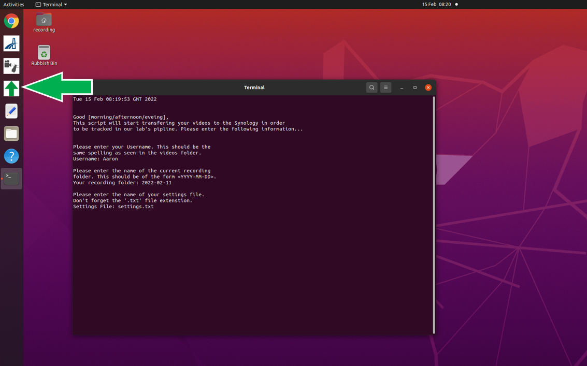

This transfer script copies your videos to 3 separate locations. First it copies all the videos in the directory (and not just the ones in the settings file) to the `GoodwinGroup` Synology. You can find the folder of the days videos in a folder called `BehaviourVideos` in your user folder (I realize this sentence isn't very clear ...). For example, if I `Aaron`, transferred videos that were recorded on `2022-02-11`, then I would find them in `GoodwinGroup/Aaron/BehaviourVideos/2022-02-11/...`. Secondly, the script copies all your videos in the specified folder to an archive directory, just in case needed. Lastly, the script transcodes, cuts, and transfers the videos specified in the settings file to the `ToBeTracked` Synology. This is where the automated scheduled _"pipeline"_ will look for videos once a week.

Please be kind to other users! **Do not** start your video transfer if someone else is scheduled to use the station right after you. Before starting the transfer, look in the Google calendar to see if anyone else has added a booking since you started your recordings.

The file transfer will take around 5-10 minutes per hour of video. So if someone did start a transfer and you need to record a video, you shouldn't have to wait too long.


**_Navigation:_**
- [Back to top](#top)
- [Back to Recording Station](#rec)
- [Previous: Usage](#usage)
- [Next: Tracking](#tracking)


# Tracking:
<a name="tracking"></a>

The tracking  _"pipline"_ is scheduled to run every Friday night to process all videos accumulated through the week. The _"pipline"_ takes ~14 hours to run 10 videos in parallel. So when the tracking finishes depends on how many videos, in total, were recorded that week. Typically the tracking should be finished by the following Monday morning (but may be ready by as early as Saturday morning).

During this stage, you (the end user) do not need to do anything except wait. Thank you for your patience.

**_Navigation:_**
- [Back to top](#top)
- [Previous: Recording Station](#rec)
- [Next: Tracking Results](#results)


# Tracking Results:
<a name="results"></a>

## Where are my results?

Your tracking results will automatically be transferred to the `Tracked` volume on our `VideosUpload` Synology.

To access your data you either need to be attached to a wired internet connection in the CNCB, or connected via the [MSD VPN](https://www.medsci.ox.ac.uk/divisional-services/support-services-1/information-technology/document-and-file-storage/vpn). You will need to use the MSD VPN if you are at home, but will also have to use it if you are connected to eduroam while in the CNCB. Due to additional security required for the MSD, eduroam connections do not have access to the local network in the CNCB.

You can access your data multiple ways. The preferred methods would be to use either [FileZilla](https://filezilla-project.org/) or map a network drive (see below). If you are more comfortable at the terminal feel free to use `ssh` and either `scp` or `rsync` to get your data. All methods will require for you to have a user name and password for the Synologys. If you currently don't have any login information (or forget your information), please see Aaron or Annika to sort this out for you. Your data can be accessed through Synology's web interface, but I do not recommend this as downloading your data this way is much slower then the others (not to mention one of the Synology's web interface refuses to connect when on the VPN).

It should also be noted that these Synologys are not centrally managed, University of Oxford, network drives. These are just a couple of file server computers sitting in the CNCB.

**_Navigation:_**
- [Back to top](#top)
- [Back to Tracking Results](#results)
- [Previous: Tracking](#tracking)


### FileZilla:

[FileZilla](https://filezilla-project.org/) is a free and open source piece of software that allows you to make an `ftp` connection. To make a connection to the Synology, you'll need to enter the following:
* `Host`: the ip address of the Synology, of the form xxx.x.xx.xxx
* `Username`: your username
* `Password`: your password
* `Port`: 22

<!-- When making a connection for the first time you will be prompted with ... -->


There is extensive documentation available online for how to use FileZilla; if you have any further questions, please feel free to look around.

**_Navigation:_**
- [Back to top](#top)
- [Back to Tracking Results](#results)
- [Previous: Tracking](#tracking)

### Map a network drive:

By using "Map a network drive" or "Connect to Server", you will be able to view and access the contents of the Synology from "Finder" or "File Explorer".


macOS - here are a few links that may help:
* [link1](https://support.apple.com/en-mt/guide/mac-help/mchlp1140/mac)
* [link2](https://setapp.com/how-to/map-a-network-drive-on-mac)
* [link3](https://www.lifewire.com/how-to-map-network-drive-mac-4707917)

Windows - here are a few links that may help:
* [link1](https://support.microsoft.com/en-us/windows/map-a-network-drive-in-windows-10-29ce55d1-34e3-a7e2-4801-131475f9557d)
* [link2](https://www.dummies.com/article/technology/information-technology/networking/general-networking/mapping-network-drives-164954)
* [link3](https://www.howtogeek.com/762111/how-to-map-a-network-drive-on-windows-10/)


If any of the links are either not working or maybe not the most up to date, feel free to use this handy [tool](https://www.google.co.uk/).

**_Navigation:_**
- [Back to top](#top)
- [Back to Tracking Results](#results)
- [Previous: Tracking](#tracking)

## Navigating your results:

Once the tracking results are ready, they will be transferred to the `VideosUpload` Synology in a new folder, named for the date that the tracking started, inside your existing folder. Inside this folder (e.g. `Tracted/Aaron/20220125-110453/`) there will be a folder for each video that was tracked for you this week.

The directory structure is as follows for each video:
```
    - example_video_1/
        - Backups/...
        - Logs/...
        - Results/
            - example_video_1_ALLDATA_R.csv.gz
            - example_video_1_Diagnostic_Plots_R.pdf
            - example_video_1_Ethogram.pdf
            - example_video_1_Indices.csv
        - example_video_1/
            - example_video_1_JAABA/...
            - ids.mat
            - example_video_1-bg.mat
            - example_video_1-feat.mat
            - example_video_1-params.mat
            - example_video_1-track.mat
        - example_video_1.mp4
        - calibration.mat
```


For the most part, you will likely want to focus on the files in the `Results/` folder. This folder contains summary plots and summary statistics of the tracking data. The description of the files within are as follows:

**_Navigation:_**
- [Back to top](#top)
- [Back to Tracking Results](#results)
- [Previous: Tracking](#tracking)

### Results/example_video_1_ALLDATA_R.csv.gz:

A compressed csv file containing all the data extracted from the `example_video_1-track.mat` file, the `example_video_1-feat.mat` file, and data from the `example_video_1/example_video_1_JAABA/scores_*.mat` files, if they exist. This file is used to load the data into R to make the `Results/example_video_1_Diagnostic_Plots_R.pdf` file, the `Results/example_video_1_Ethogram.pdf`, and the `Results/example_video_1_Indices.csv`. This file can be loaded into any other software you like. But beware, it is large - for tracking of 40 flies for 15 minutes at 25 frames per second, this file is ~5GB when uncompressed. The columns of this table is as follows:
- `Frame`: The frame number.
- `Fly_Id`: The Id of the fly.
- `Feature`: The name of the measured feature.
- `Units`: The unit of the measured feature.
- `Value`: The value of the measured feature.
- `Data_Source`: Where the data was extracted from - either "track.mat", "feat.mat", or "jaaba".

**_Navigation:_**
- [Back to top](#top)
- [Back to Tracking Results](#results)
- [Previous: Tracking](#tracking)

### Results/example_video_1_Diagnostic_Plots_R.pdf:

A series of A4 pdf plots showing some of the raw tracking data. This can be used to quickly visually inspect how well the tracking performed. Contains 2 pages per arena that contained flies.

An example of the "Area" diagnostic plot for fly Id 1 and 2 in arena 1.
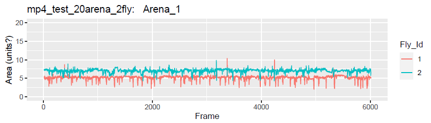

**_Navigation:_**
- [Back to top](#top)
- [Back to Tracking Results](#results)
- [Previous: Tracking](#tracking)

### Results/example_video_1_Ethogram.pdf:

A series of A4 pdf plots showing the results of the JAABA annotated behaviours for each fly. This file is only generated for courtship assays with 2 flies per arena. There is 1 page per arena with one plot for each fly.

An example of the ethogram plot for a fly can be seen below. This shows the JAABA predictions for the 6 scored courtship behaviours, and copulation. A verticle black line is drawn if JAABA predicted that the fly performed the behaviour for that frame.

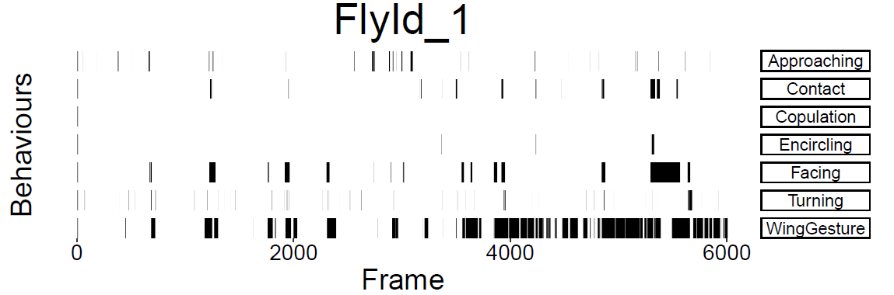

**_Navigation:_**
- [Back to top](#top)
- [Back to Tracking Results](#results)
- [Previous: Tracking](#tracking)

### Results/example_video_1_Indices.csv:

A csv file containing the computed courtship indices derived from the JAABA annotated behaviour scores. The columns of this table is as follows:
- `FileName`: The name of your video.
- `ArenaNumber`: The arena number, numbered from left to right and top to bottom. See below.
- `FlyId`: The Id of the fly. See below.
- `CI`: Courtship index (excluding the facing behaviour). Courtship index is the percentage of time the focal fly exhibit any courtship (JAABA) behaviour (excluding the facing behaviour).
- `CIwF`: Courtship index (including the facing behaviour). Courtship index is the percentage of time the focal fly exhibit any courtship (JAABA) behaviour.
- `approaching`: Approaching index. The percentage of time that the focal fly was approaching the other fly.
- `contact`: Contact index. The percentage of time that the leg, proboscis, or head of the focal fly contacted any part the other fly.
- `circling`: Circling index. The percentage of time that the focal fly walked sideways while facing and being close to the other fly.
- `facing`: Facing index. The percentage of time that the focal flies head was oriented toward the other fly, while not being on the opposite side of the chamber.
- `turning`: Turning index. The percentage of time that the focal fly turned their body to orient toward the other fly while not moving forward.
- `wing`: Wing index. The percentage of time that the focal fly extended a wing beyond their body.
- `denominator`: The duration of the time window (in seconds) for which these indices were calculated.
- `predicted_sex`: The predicted sex of the flies, as determined by the user supplied proportion of male flies per arena and the relative sizes of the flies per arena. When calculating the fly area we skip the first 10 seconds and ignore all frames after copulation initiation (the predicted sex in the `example_video_1-track.mat` and `example_video_1_JAABA/trx.mat` files, uses the area for the duration of tracking).

By default flies need to "initiate courtship" before we will calculate an index. Flies need to perform any of the courtship-like behaviours for at least 3 seconds of a 6 second window (the facing behaviour is not used to assess courtship initiation). These indices are then from the courtship initiation until either 1. the flies copulate, 2. 10 minutes has passed since courtship initiation, or 3. we've reached the end of the tracking data, which ever occurs first.

**_Navigation:_**
- [Back to top](#top)
- [Back to Tracking Results](#results)
- [Previous: Tracking](#tracking)

### Other files:


- `Backups/...`: We make multiple changes to the generated tracking files. Before we make any of our changes, we copy the file that will be modified to this directory.
- `Logs/...`: This folder contains multiple log files and error files that can be useful while diagnosing tracking errors.
- `example_video_1/example_video_1_JAABA/...`: This folder contains all of the files needed for performing the JAABA analysis, as well as the `scores_*.mat` results files.
- `example_video_1/ids.mat`: This file is generated while re-assigning identities.
- `example_video_1/example_video_1-bg.mat`: This is the background model used during tracking.
- `example_video_1/example_video_1-feat.mat`: "[F]eatures derived from tracking data (e.g. velocity, distance to wall)"
- `example_video_1/example_video_1-params.mat`: A log of the parameters used while tracking.
- `example_video_1/example_video_1-track.mat`: "[R]aw tracking data (e.g. position, orientation, left wing angle)"

**_Navigation:_**
- [Back to top](#top)
- [Back to Tracking Results](#results)
- [Previous: Tracking](#tracking)

### Arena and Fly Numbering:

When we run `reassign_identities`, the arenas are re-numbered from left to right, and then top to bottom. The arenas are numbered in this fashion whether there are flies in the arena or not. An example of the arena numbering can be seen below for one of our courtship chambers with `number_of_arenas` = 20 with `flies_per_arena` = 2.

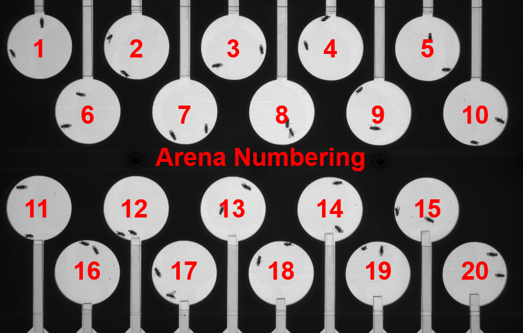


When we run `reassign_identities`, the fly Ids are re-numbered such that the flies in arena 1 are 1 to `flies_per_arena`. The fly Ids in arena 2 are re-numbered `flies_per_arena + 1` to `2 x flies_per_arena`, and so on. The fly Ids are numbered in this fashion whether there are flies in the arena or not. An example of the fly numbering can be seen below for one of our courtship chambers with `number_of_arenas` = 20 with `flies_per_arena` = 2.


**_Navigation:_**
- [Back to top](#top)
- [Back to Tracking Results](#results)
- [Previous: Tracking](#tracking)
